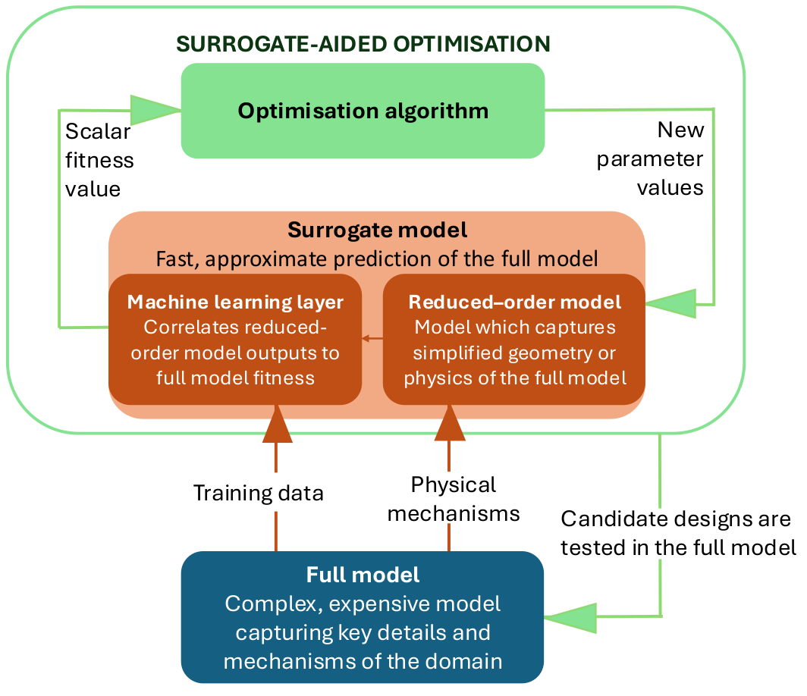

# MxL-GEN: A Modular Workflow for Mechanistic Learning based Surrogates, for use in Optimisation

## Introduction

MxL-GEN is a modular codebase implementing mechanistic learning: the combination of machine learning and mechanistic models.

The main sections o fthis codebase are as follows:
- High-fidelity ground truth simulations  
- Fast reduced-order models  
- Machine-learning surrogates  
- Coupling to pyMOS optimiser (a multi-strategy evolutionary optimiser)

The framework is intended for problems where high-fidelity simulations are expensive or slow and a surrogate can greatly accelerate optimisation.

This README describes the repository structure, installation steps, user-provided components, and the example pipeline included with the codebase.

This workflow is shown in the diagram below:





---

## Quick Overview

MxL-GEN implements an end-to-end workflow:

1. Run full-model simulations to build a ground-truth dataset.  
2. Extract reduced-model features to form surrogate training inputs.  
3. Train and validate ML surrogates (model selection, CV, diagnostics).  
4. Use the surrogate inside an optimiser to accelerate search.  
5. Validate the final solution using the full model.


---

## Installation

For macs / linux follow these instructions.
This install the package as editable.

```
git clone git@bitbucket.org:jerugroup/mxl-gen.git
cd MxL-GEN
# optional to install a sufficiently advanced python
pyenv install -s 3.10.11 

# create and activate a virtual env
pyenv virtualenv 3.10.11 mxl-gen-env
pyenv activate mxl-gen-env

# editable install of package
pip3 install --upgrade pip setuptools wheel
pip3 install -e .

```

Code from the package can now be used as MxL_GEN

To reset if necessary
```
rm -rf build/ dist/ *.egg-info
```

### PyMOS optimisation code
The optimisation part of the methodology utilises the MOS-based optimisation of PyMOS.
If this has not yet been released through pip install, pyMOS can be downloaded from .... 

The pyMOS version used here is aligned with commit 62692a22284a4d1e27f393c1d19fb7ceb9268bd7

### Use the Wiki

Install mkdocs to generate the manual.
```
pip install mkdocs mkdocs-material mkdocs-drawio-exporter mkdocstrings
mkdocs serve
```
Go to: [localhost:8000](http://localhost:8000)

---


## Running a new problem
The problem must be set up to provide the codebase with a template for the full model and a template for the reduced-order model.
Both these templates must exist as self-contained directories. The models interact with MxL-GEN via the user-specified `encoding.py` 
file which contains critical functions which act as links between the models and the parameter vector used by PyMOS. 

A minimal working example is provided to guide new users.
From the `examples` directory has structure

```
examples/
  |-- exampleTemplates/
  |-- encoding.py
  `-- execution.py 
```

### User-Provided Functions

These **must** be defined in encoding.py:

- parameter_to_model(values, folder)  
  Writes the simulation configuration files for the reduced or full model.  
  Defines how parameter vectors (phenotype) map to model inputs (genotype).

- extract_surrogate_inputs(folder) → numpy.ndarray  
  Runs or parses the reduced model outputs and returns the features which will be inputs into the surrogate.  
  This is used during training and optimisation.

- extract_fitness(folder) → float  
  Parses the full-model simulation results and returns the fitness value.

- Optional: preprocess_parameters(values) → (discard_flag, new_values)  
  Used to enforce constraints, filters, feasibility projections, or corrections before running simulations.
  


The full methodology can be run by executing.
```
python3 execution.py
```

This will:

- Create ground-truth runs  
- Extract surrogate inputs and outputs  
- Perform data exploration (plots saved to surrogateCreation/)  
- Run model selection and fit a surrogate  
- Save the best surrogate as a pickle file  
- Run surrogate-assisted optimisation  
- Run a final full-model evaluation of the optimum  

---


---

## Repository Structure

```
MxL-GEN/
|-- optimisation/
|-- surrogate_model/
`-- create_ground_truth.py 
```

The sections below describe each module.

---

## Codebase Components

### 1. Ground Truth Generation (create_ground_truth/)

**start_new_runs.py**

- Copies the full-model template into groundTruth/runN  
- Generates random parameter vectors  
- Applies preprocess_parameters (if provided)  
- Writes design_parameters.csv  
- Calls parameter_to_model to configure the full model  
- Executes run.sh inside each run folder  
- Enforces a CPU budget using endedSim.txt signals  

**extractData.py**

- Iterates through groundTruth/runN folders  
- Calls extract_surrogate_inputs and extract_fitness  
- Produces surrogateCreation/trainingInput.csv and trainingOutput.csv  

---

### 2. Surrogate Data Exploration (surrogate_model/data_exploration.py)

Provides tools for:

- Correlation matrices  
- Histograms and KDEs  
- Pairplots  
- PCA variance analysis  
- Missing value reports  
- Outlier detection (zscore or IQR methods)  
- Feature-importance proxy (RandomForest)

Outputs saved to surrogateCreation/ (default).

---

### 3. Surrogate Model Training (surrogate_model/ml_models.py)

Tests and builds a predictive ML layer from the Uses scikit-learn pipelines:

- StandardScaler  
- Optional PCA  
- Estimator from DEFAULT_MODEL_DICT  

Supports:

- Randomised or grid search  
- Holdout evaluation  
- Nested cross-validation  
- Leave-One-Out CV  
- Automatic best-model tracking  
- Saving pipelines via pickle  

Metrics and results are logged as CSV and JSON files.

DEFAULT_MODEL_DICT comes from ml_helpers.py and includes Linear, Ridge, Lasso, Decision Tree, Random Forest, Gradient Boosting, SVR, and MLP.

---

### 4. Surrogate Visualisation Tools (surrogate_model/ml_plotter.py)

Functions:

- plot_results: combined scatter plot for true vs predicted  
- plot_nested_results: fold-aggregated scatter plots  
- feature_importance: evaluates feature importance through  
  - feature_importances_  
  - coef_  
  - permutation importance  
  and back-maps importance through PCA if present  

---

### 5. Surrogate-Based Optimisation (optimisation/)

**optimisation_fitness.py**

- Wraps reduced-model template evaluation  
- Combines parameter_to_model + extract_surrogate_inputs  
- Uses the trained surrogate to compute fitness  
- Logs fitness.csv and discarded_parameters.csv  

**run_optimisation.py**

- Integrates SHADE and MTS into a MOS framework using PyMOS  
- Manages Dask parallelism  
- Uses surrogate manager to retrain/update models  
- Tracks fitness evaluation budgets  
- Saves optimiser logs and final results  

---

## Output Locations

Default output locations are used for the following parts of the code:
- surrogateCreation/: all surrogate-related plots, logs, and pipelines  
- groundTruth/: all full-model simulations  
- optimisation_logs/: optimiser logs and results  
- run_optimisation_test/: example optimisation run folder  

---

## Troubleshooting

- If surrogateCreation/best_pipeline.pkl is missing, ensure the model training step has completed and the pipeline has been saved to the correct filename.  
- For plotting issues, ensure seaborn/pandas versions are compatible.  
- For parallelism issues, reduce n_jobs or adjust Dask cluster parameters.  

---

## Citation

If you use MxL-GEN in academic work, please cite this repository and any associated methodology papers.
